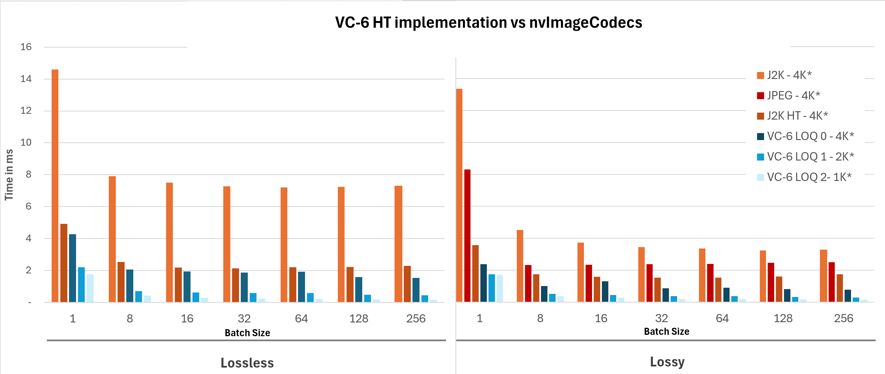

# VC-6 Samples

**License:** BSD-3-Clause-Clear (see LICENSE)
**Copyright:** © 2014–2025 V-Nova International Limited Distribution: Made available by V-Nova Limited, a wholly owned subsidiary of V-Nova International Limited.

---

## Requirements

- Python 3.8+ (for VC-6)
- Python 3.10+ (for the optional NVIDIA DALI sample on native Linux or WSL2)
- CUDA 12.9 (for CUDA backend)

```bash
pip install -r requirements.txt
```

On native Windows, `pip install -r requirements.txt` will not install NVIDIA DALI. NVIDIA's prebuilt DALI wheels are Linux-only, so the DALI resize sample is intended for native Linux or for a Linux environment inside WSL2.

## Installation

Install the VC-6 SDK package for your preferred backend:

```bash
pip install vc6[cuda]     # CUDA backend (Linux, Windows)
pip install vc6[cu120]    # Legacy CUDA backend, compatible with CUDA 12.0+
pip install vc6[opencl]   # OpenCL backend (Linux, Windows)
```

## First Run - EULA Acceptance

The first time the codec is imported, you'll be prompted to accept the EULA, user interaction is required. This is a one-time process that fetches the license automatically.

---

## Sample Scripts

### Encoding

| Script | Description | CPU | CUDA | OpenCL |
|--------|-------------|-----|------|--------|
| `encode/encoder.py` | VC-6 EncoderSync | ✓ | ✓ | ✓ |
| `encode/batch_encoder.py` | VC-6 BatchEncoder | | ✓ | ✓ |

### Decoding

| Script | Decoder | Description | CPU | CUDA | OpenCL |
|--------|---------|-------------|-----|------|--------|
| `decode/decoder.py` | DecoderSync | | ✓ | ✓ | ✓ |
| `decode/decode_region_of_interest.py` | DecoderSync | with Region of Interest extraction | ✓ | ✓ | ✓ |
| `decode/thumbnail_roi_sample.py` | DecoderAsync | Generates thumbnails and ROI extracts at different LOQs | ✓ | ✓ | ✓ | 
| `decode/batch_decoder_experimental.py` | BatchDecoderSync | | | ✓ | |
| `decode/partial_fetch_and_decode.py` | BatchDecoderSync |  partial fetch (only reads bytes needed for target LOQ) | | ✓ | |
| `decode/decode_resize_cuda_memory_dali.py` | BatchDecoderSync native Linux or WSL2 Linux environment only) | CUDA Decoder with DALI-based resize | | ✓ | |

---

## Running the Samples

All samples support `--help` to display available options.

### Encoding Examples

```bash
# Encode using CUDA backend (lossy mode, default)
python encode/encoder.py --backend cuda -s input_images/ -d encoded/

# Encode using OpenCL backend
python encode/encoder.py --backend opencl -s input_images/ -d encoded/

# Encode using CPU backend in lossless mode
python encode/encoder.py --backend cpu --mode lossless -s input_images/ -d encoded/

# Batch encode with batched processing (CUDA)
python encode/batch_encoder.py --backend cuda -b 4 -s input_images/ -d encoded/

# Batch encode with OpenCL backend
python encode/batch_encoder.py --backend opencl -b 4 -s input_images/ -d encoded/
```

### Decoding Examples

```bash
# Decode using CUDA backend
python decode/decoder.py --backend cuda -s encoded/ -d decoded/

# Decode using OpenCL backend
python decode/decoder.py --backend opencl -s encoded/ -d decoded/

# Decode using Metal backend (macOS only)
python decode/decoder.py --backend metal -s encoded/ -d decoded/

# Decode at a lower Level of Quality (faster, smaller output)
python decode/decoder.py --backend cuda -l 2 -s encoded/ -d decoded/

# Experimental batch decoder with CUDA device memory output
python decode/batch_decoder_experimental.py -b 4 -s encoded/ -d decoded/

# Decode with Region of Interest extraction
python decode/decode_region_of_interest.py -roix 100 -roiy 100 -roiw 224 -roih 224 -s encoded/ -d decoded/

# Decode and resize using NVIDIA DALI (native Linux or WSL2 Linux environment only)
python decode/decode_resize_cuda_memory_dali.py -rw 224 -rh 224 -s encoded/ -d decoded/

# Decode using ROI TruncatedBitstream producer/consumer flow
python decode/partial_roi_fetch_and_decode.py --backend cuda -s encoded/ -d decoded/
```

---

### Basic Encoder/Decoder Usage

```python
from vnova.vc6_cuda import codec as vc6codec

# Setup an encoder
encoder = vc6codec.EncoderSync(
    1920, 1080,
    vc6codec.CodecBackendType.CPU,
    vc6codec.PictureFormat.RGB_8,
    vc6codec.ImageMemoryType.CPU
)
encoder.set_generic_preset(vc6codec.EncoderGenericPreset.LOSSLESS)

# Setup a decode
decoder = vc6codec.DecoderSync(
    1920, 1080,
    vc6codec.CodecBackendType.CPU,
    vc6codec.PictureFormat.RGB_8,
    vc6codec.ImageMemoryType.CPU
)

# Encode file to memory
encoded_image = encoder.read("input.rgb")

# Decode to file
decoder.write(encoded_image.memoryview, "output.rgb")
```

### CUDA Device Memory Output

When using `vc6_cuda`, decoder output can be CUDA device memory. Output images expose `__cuda_array_interface__` for interoperability with CuPy, PyTorch, and nvImageCodec.

```python
import cupy
from vnova.vc6_cuda import codec as vc6codec

# Setup decoder with CUDA device output
decoder = vc6codec.DecoderSync(
    1920, 1080,
    vc6codec.CodecBackendType.GPU,
    vc6codec.PictureFormat.RGB_8,
    vc6codec.ImageMemoryType.CUDA_DEVICE
)

# Decode from file
decoded_image = decoder.read("input.vc6")

# Convert to CuPy array and copy to CPU
cuda_array = cupy.asarray(decoded_image)
cpu_array = cuda_array.get()

# Write to file
with open("output.rgb", "wb") as f:
    f.write(cpu_array.tobytes())
```

> **Note:** Accessing `__cuda_array_interface__` is blocking and waits for decode to complete.
> The interface returns one-dimensional unsigned 8-bit data; reshaping is up to the user.

## Environment Variables

### OpenCL (vc6_opencl)
```bash
export OCL_BIN_LOC=./tmp/clbin   # GPU binary cache location
export OCL_DEVICE=nvidia          # Target GPU hint
```

### CUDA (vc6_cuda)
```bash
export CUDA_BIN_LOC=./tmp/clbin  # GPU binary cache location
```

For more details refer to the [VC6-SDK documentation](https://docs.v-nova.com/technologies/smpte.vc-6/).

---

## Benchmarking

The benchmarking suite performs performance comparisons between VC-6 and other codecs (JPEG, JPEG 2000, JPEG 2000 HT) for decode operations. The tests automatically downloads datasets from HuggingFace (V-NovaLtd/UHD-IQA-* repositories) if they don't already exist locally. Datasets are organized by codec type and use consistent file naming across all codecs to ensure fair comparisons. The benchmark measures decode throughput at various batch sizes and generates performance plots showing time per image in milliseconds.

## Results

Here are decode performance benchmarks for V-Nova’s SDK version 8.3.0, implementing SMPTE VC-6 with CUDA acceleration, compared with NVIDIA nvImageCodec 0.6.1.37 using JPEG, JPEG 2000 (J2K), and High-Throughput JPEG 2000 (HTJ2K). The benchmark uses the [IQA 4K dataset](https://huggingface.co/V-NovaLtd).

For reproducibility, tests were run on an AWS g6e.8xlarge instance equipped with an NVIDIA L40S GPU. This platform supports hardware-accelerated JPEG decoding through nvImageCodec, where applicable, and GPU-accelerated decode paths for the tested formats.

The benchmark measures per-image decode time across multiple batch sizes, in both lossy and lossless configurations. Lossy tests compare VC-6, JPEG, J2K, and HTJ2K. Lossless tests compare VC-6, J2K, and HTJ2K, as JPEG does not support lossless coding.

Under these test conditions, VC-6 achieved faster per-image decode times than the tested nvImageCodec baselines across both lossy and lossless configurations. The advantage increases when VC-6 is decoded at lower Levels of Quality (LoQs), where only the resolution required by a given AI model is reconstructed, i.e., partial decoding.

This emphasises VC-6's relevance for vision AI pipelines, where models typically operate on lower-resolution inputs and not always require full-resolution reconstruction; thereby reducing preprocessing time and increasing throughput.


## VC-6 HT vs nvImageCodec Batch Decode Performance



For more details results please refer to this [Benchmarking README](./benchmarking/Benchmarking_README.md)


### Dataset Downloads

The benchmarking system automatically downloads test datasets from HuggingFace:
- **Lossy mode**: Uses `test` split from V-NovaLtd/UHD-IQA-VC6, UHD-IQA-JPG, UHD-IQA-J2K, UHD-IQA-JPH
- **Lossless mode**: Uses `test` split from V-NovaLtd/UHD-IQA-VC6-Lossless, UHD-IQA-J2K-Lossless, UHD-IQA-JPH-Lossless

Files are downloaded to `DATASET_DIR/lossy/` or `DATASET_DIR/lossless/` based on the `LOSSLESS` configuration, organized into codec-specific subdirectories (VC-6, JPEG (lossy only), J2K, J2K_HT). The download process extracts individual files from tar archives and ensures all codecs have matching file sets for consistent benchmarking.

## Requirements

```bash
pip install -r benchmarking/requirements.txt
```

The benchmarking scripts require a CUDA-enabled `torch` build. Depending on your platform and existing environment, `pip install -r benchmarking/requirements.txt` may leave you with a CPU-only PyTorch install.
If that happens, replace `torch` before running the benchmarks:

```bash
pip uninstall -y torch
pip install --upgrade --index-url https://download.pytorch.org/whl/cu128 torch
```

The DALI dependency in the benchmarking requirements is available only in Linux environments, including native Linux and Python running inside WSL2. It is not available on native Windows. Resize benchmarks that use DALI are skipped automatically when the package is unavailable.
The benchmarking suite also requires `nvidia-nvimgcodec-cu12`, which is included in `benchmarking/requirements.txt`. Recent `nvidia-nvimgcodec-cu12` builds expose `nvimgcodec.ColorSpec.SYCC`, so the benchmark code accepts `SYCC` and falls back to `YCC` for older package variants.

## Test Configuration

Test parameters are configured in `benchmarking/global_vars.py`.
Please set `DATASET_DIR` to the directory where you want to download all the images for the tests.

### Defaults

| Parameter | Description | Default |
|-----------|-------------|---------|
| `batch_sizes` | Batch sizes to test. Configure based on available VRAM. | `[8, 16, 32, 64, 128, 256]` |
| `MAX_VC6_BATCH` | Maximum batch size for non-batch VC-6 tests | `16` |
| `LOSSLESS` | Use lossless datasets (`True`) or lossy datasets (`False`) | `False` |
| `DEBUG_DUMP_IMAGES` | Dump decoded images as PNGs under `debug_dump_images/<codec>` | `False` |
| `CAPTURE_HW_STATS` | Capture per-batch CPU/GPU utilization samples | `True` |
| `DEBUG_DUMP_DIR` | Output directory for debug image dumps | `debug_dump_images` |
| `resize_dims` | Resize dimensions for resize tests | `[(834, 834), (417, 417)]` |
| `resize_params` | Batch/resize combinations derived from `batch_sizes` and `resize_dims` | `list(itertools.product(batch_sizes, resize_dims))` |
| `DATASET_DIR` | Root directory for datasets | `huggingface` |
| `RAW_FILES` | Base directory for dataset files | `DATASET_DIR + "/lossless" if LOSSLESS else DATASET_DIR + "/lossy"` |
| `TOTAL_IMAGES` | Number of images to use for benchmarking | `256` |
| `NUM_BATCHES` | Number of batches to run per test | `100` |
| `WARMUP_RUNS` | Number of warmup batches before timing | `50` |

### Dataset and Codec Mappings

```python
DATASET_MAPPING_LOSSY = {
    "V-NovaLtd/UHD-IQA-VC6": "VC-6",
    "V-NovaLtd/UHD-IQA-JPG": "JPEG",
    "V-NovaLtd/UHD-IQA-J2K": "J2K",
    "V-NovaLtd/UHD-IQA-JPH": "J2K_HT",
}

DATASET_MAPPING_LOSSLESS = {
    "V-NovaLtd/UHD-IQA-VC6-Lossless": "VC-6",
    "V-NovaLtd/UHD-IQA-J2K-Lossless": "J2K",
    "V-NovaLtd/UHD-IQA-JPH-Lossless": "J2K_HT",
}

CODEC_EXTENSIONS = {
    "VC-6": ".vc6",
    "JPEG": ".jpg",
    "J2K": ".jp2",
    "J2K_HT": ".jp2",
}
```

### Dataset Mappings

- **Lossy datasets**: V-NovaLtd/UHD-IQA-VC6 → VC-6, UHD-IQA-JPG → JPEG, UHD-IQA-J2K → J2K, UHD-IQA-JPH → J2K_HT
- **Lossless datasets**: V-NovaLtd/UHD-IQA-VC6-Lossless → VC-6, UHD-IQA-J2K-Lossless → J2K, UHD-IQA-JPH-Lossless → J2K_HT

## Runtime Configuration

Runtime options are configured in `run_benchmaring.sh`:

| Variable | Description | Default |
|----------|-------------|---------|
| `NSYS_ENABLED` | Set to `1` to enable nsys profiling, `0` to run without profiling | `0` |
| `ENABLE_DEBUG` | Set to `1` to enable verbose logging (`-vv --log-cli-level=INFO`) | `0` |

The script performs the following steps:
1. **Dataset Download**: Runs `test_download_datasets.py` to ensure all required datasets are available. If downloads fail, the script aborts.
2. **Performance Tests**: Runs decode performance tests matching `test_decode_performance`.
3. **Profiling** (optional): If `NSYS_ENABLED=1`, runs tests with nsys profiling enabled.
4. **Results Plotting**: Automatically generates performance plots from test results, including ROI truncated-bitstream plots when ROI benchmarks are present.
5. **HTML Report**: `benchmarking/plot_results.py` writes `benchmark_report.html` with tabs per codec/LOQ and per-run metrics.

### Windows Notes

- The HTML report uses PowerShell or WMIC to collect CPU and memory info on Windows.
- GPU details rely on `nvidia-smi` being available on PATH.

## Run Benchmark

```bash
./run_benchmarking.sh
```


## Contributing

We're not accepting external contributions right now. We may open issues and pull requests in the future—watch or star this repo for updates.

If you plan to contribute later, include this header at the top of each new source file:
```
# SPDX-License-Identifier: BSD-3-Clause-Clear
# Copyright (c) 2014-2025 V-Nova International Limited
```

## Security

If you believe you’ve found a vulnerability in these samples, email ai@v-nova.com with details and a reproducible example if possible. Please do not open public issues for sensitive reports.

## Support / Questions

For questions, please contact ai@v-nova.com. We'll enable GitHub Issues when contributions open.
