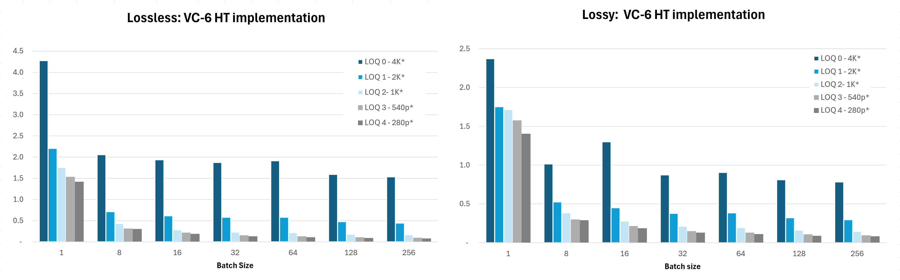

# Benchmarking Results

## Executive Summary

Here are decode performance benchmarks for V-Nova’s SDK version 8.3.0, implementing SMPTE VC-6 with CUDA acceleration, compared with NVIDIA nvImageCodec 0.6.1.37 using JPEG, JPEG 2000 (J2K), and High-Throughput JPEG 2000 (HTJ2K). The benchmark uses the [IQA 4K dataset](https://huggingface.co/V-NovaLtd).

For reproducibility, tests were run on an AWS g6e.8xlarge instance equipped with an NVIDIA L40S GPU. This platform supports hardware-accelerated JPEG decoding through nvImageCodec, where applicable, and GPU-accelerated decode paths for the tested formats.

The benchmark measures per-image decode time across multiple batch sizes, in both lossy and lossless configurations. Lossy tests compare VC-6, JPEG, J2K, and HTJ2K. Lossless tests compare VC-6, J2K, and HTJ2K, as JPEG does not support lossless coding.

Under these test conditions, VC-6 achieved faster per-image decode times than the tested nvImageCodec baselines across both lossy and lossless configurations. The advantage increases when VC-6 is decoded at lower Levels of Quality (LoQs), where only the resolution required by a given AI model is reconstructed, i.e., partial decoding.

This emphasises VC-6's relevance for vision AI pipelines, where models typically operate on lower-resolution inputs and not always require full-resolution reconstruction; thereby reducing preprocessing time and increasing throughput.

---

## Test Set-Up

The benchmark decodes up to 256 pre-encoded 4K images from the [IQA 4K dataset](https://huggingface.co/V-NovaLtd) across multiple batch sizes: 1, 8, 16, 32, 64, 128, and 256. The objective is to measure per-image decode time and throughput scaling as batch size increases. For VC-6, the partial decoding performance is also measured. This was not possible for JPEG2000, as this feature is not availale in the nvImageCodec implementation.

To align with the numbers below:

- Change line 105 in `benchmarking/test_vc6_performance.py` from `num_backends=0` to `num_backends=(batch_size + 1) // 2`.
- For VC-6 versions `8.3` and later, change `BatchDecoder_exp` to `BatchDecoderSync` on line 98. No change is required for earlier versions.

Two encoding modes were tested:

| Mode      | Codecs tested            |
|-----------|--------------------------|
| Lossy     | VC-6, JPEG, J2K, HTJ2K   |
| Lossless  | VC-6, J2K, HTJ2K         |

JPEG is excluded from the lossless comparison because it does not support lossless coding.
For the lossy comparison, JPEG, J2K, and HTJ2K were encoded using `quality=80` through nvImageCodec. VC-6 was encoded at 1.25 bpp, selected to produce an average bitrate comparable to JPEG while maintaining similar or higher reconstruction quality in this test set.
For the lossless comparison, VC-6, J2K, and HTJ2K were encoded using their respective lossless modes.
The exact encode settings used for each codec are shown below.


---

## Lossy

### VC-6
```python
encoder.set_profile_from_preset(vc6.EncoderProfilePreset.BETTER)
encoder.set_quality_from_preset(vc6.EncoderQualityPreset.CBR_MULTIPASS, 1.25)
```

### JPEG
```python
nvimgcodec.EncodeParams(
    quality_type=nvimgcodec.QualityType.QUALITY,
    quality_value=80, color_spec=nvimgcodec.ColorSpec.YCC, 
    jpeg_encode_params=nvimgcodec.JpegEncodeParams()
)
```

### J2K
```python
nvimgcodec.EncodeParams(
    quality_type=nvimgcodec.QualityType.QUALITY, 
    quality_value=80, 
    color_spec=nvimgcodec.ColorSpec.YCC, 
    jpeg2k_encode_params=nvimgcodec.Jpeg2kEncodeParams()
)
```

### HTJ2K
```python
nvimgcodec.EncodeParams(
    uality_type=nvimgcodec.QualityType.QUALITY, 
    quality_value=80, 
    color_spec=nvimgcodec.ColorSpec.YCC, 
    jpeg2k_encode_params=nvimgcodec.Jpeg2kEncodeParams(ht=True)
)
```

---

## Lossless

### VC-6
```python
encoder.set_generic_preset(vc6.EncoderGenericPreset.LOSSLESS)
encoder.set_profile_from_preset(vc6.EncoderProfilePreset.LIGHT)
```

### J2K
```python
nvimgcodec.EncodeParams(
    quality_type=nvimgcodec.QualityType.LOSSLESS, 
    quality_value=100, 
    color_spec=nvimgcodec.ColorSpec.YCC, 
    jpeg2k_encode_params=nvimgcodec.Jpeg2kEncodeParams()
)
```

### HTJ2K
```python
nvimgcodec.EncodeParams(
    quality_type=nvimgcodec.QualityType.LOSSLESS, 
    quality_value=100, 
    color_spec=nvimgcodec.ColorSpec.YCC, 
    jpeg2k_encode_params=nvimgcodec.Jpeg2kEncodeParams(ht=True)
)
```

---

## Methodology

Each test configuration was executed 100 times, consisting of:
- 50 warm-up runs, excluded from the reported results
- 50 measured runs, used to compute the reported average

Warm-up runs are included to reduce the impact of one-off initialization costs, such as decoder setup, memory allocation, GPU context initialization, and caching effects.
For each configuration, the benchmark reports the average per-image decode time across the 50 measured runs. Throughput is derived from the same measured runs and reported as images per second.
All tests use the same set of pre-encoded images, the same batch-size sequence, and the same measurement procedure across codecs. This is intended to make the comparison reproducible and to isolate decode-time behaviour as far as practical.


---

## Results

The benchmark results show that VC-6 reduces per-image decode time compared with the tested nvImageCodec baselines across both lossy and lossless configurations.
At full-resolution decode (LoQ-0), VC-6 is faster than JPEG, J2K, and HTJ2K in the tested lossy configuration, and faster than J2K and HTJ2K in the tested lossless configuration. The difference becomes larger when decoding lower VC-6 Levels of Quality (LoQs), because fewer reconstruction layers are decoded.
The chart below reports per-image decode time across batch sizes for both lossless and lossy encodes.


### VC-6 HT vs nvImageCodec Batch Decode Performance

At a batch size of 256, the measured results show the following decode-time reductions when using VC-6 LoQ-2:


| Configuration | Comparison | Approx. speed-up |
| --- | --- | ---: |
| Lossy | VC-6 LoQ-2 vs J2K | 22.1x |
| Lossy | VC-6 LoQ-2 vs HTJ2K | 11.8x |
| Lossy | VC-6 LoQ-2 vs JPEG | 16.9x |
| Lossless | VC-6 LoQ-2 vs J2K | 44.8x |
| Lossless | VC-6 LoQ-2 vs HTJ2K | 14.1x |


These figures indicate that the main performance benefit is not only VC-6 full-resolution decode speed, but also the ability to decode only the LoQ required by the workload. For AI and image-processing pipelines that operate on lower-resolution inputs, LoQ-2 can provide an order-of-magnitude reduction in decode time versus the tested full-resolution codec baselines.


The second chart isolates VC-6 decode performance across LoQs. It shows that decode time decreases progressively as fewer LoQ layers are reconstructed.


### VC-6 decode performance by LoQ (IQA 4K dataset)


At a batch size of 256, the measured VC-6 results show that:

| Comparison | Approx. speed-up |
| --- | ---: |
| VC-6 LoQ-2 vs VC-6 LoQ-0 | 9.0x |
| VC-6 LoQ-5 vs VC-6 LoQ-0 | Up to 19.0x |

This scaling behaviour is relevant when the downstream application does not require full-resolution reconstruction. For example, many vision models resize input images before inference or embedding generation. In those cases, decoding a lower LoQ can avoid part of the decode (and corresponding data transfer) and resize work that would otherwise be performed after full-resolution reconstruction.

---

## Conclusion

In this benchmark, VC-6 achieved lower per-image decode times than the tested nvImageCodec JPEG, J2K, and HTJ2K baselines across the measured lossy and lossless configurations.

The results also show that VC-6 decode time decreases as lower Levels of Quality are selected. At a batch size of 256, VC-6 LoQ-2 was approximately 9x faster than VC-6 LoQ-0, while lower LoQs delivered further reductions in decode time.

The benchmark should be interpreted within the stated test conditions: IQA 4K dataset, 256 encoded images, AWS g6e.8xlarge with NVIDIA L40S GPU, VC-6 SDK 8.3.0, nvImageCodec 0.6.1.37, and the encode settings described above

